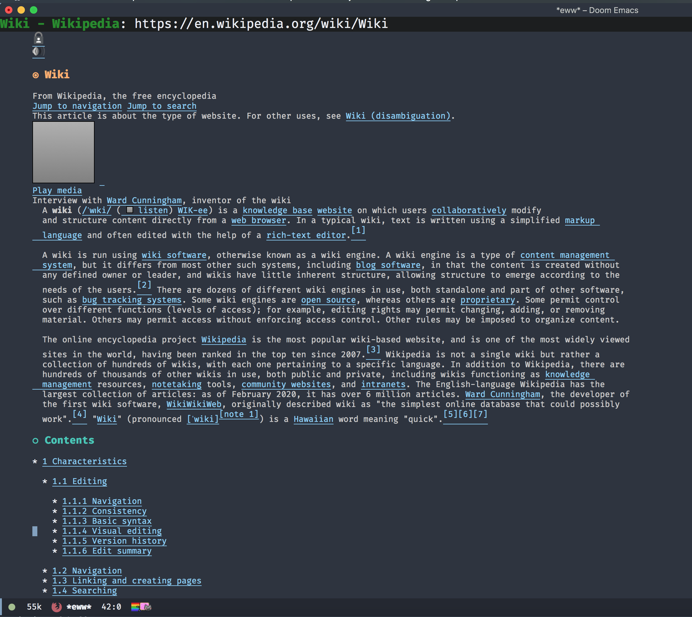
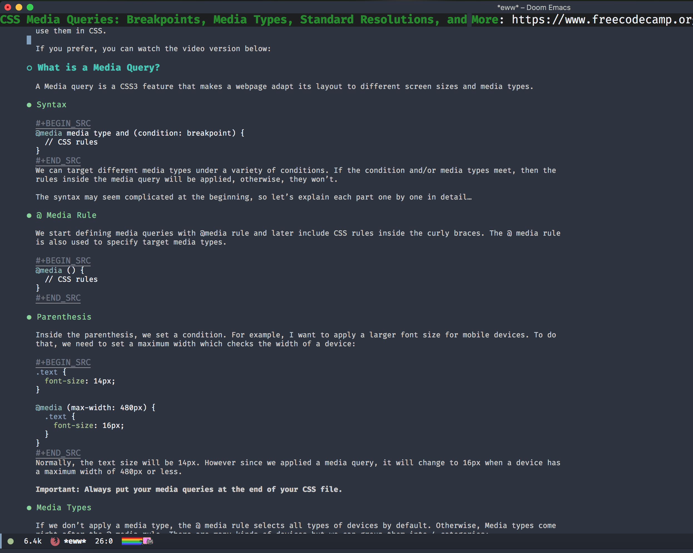
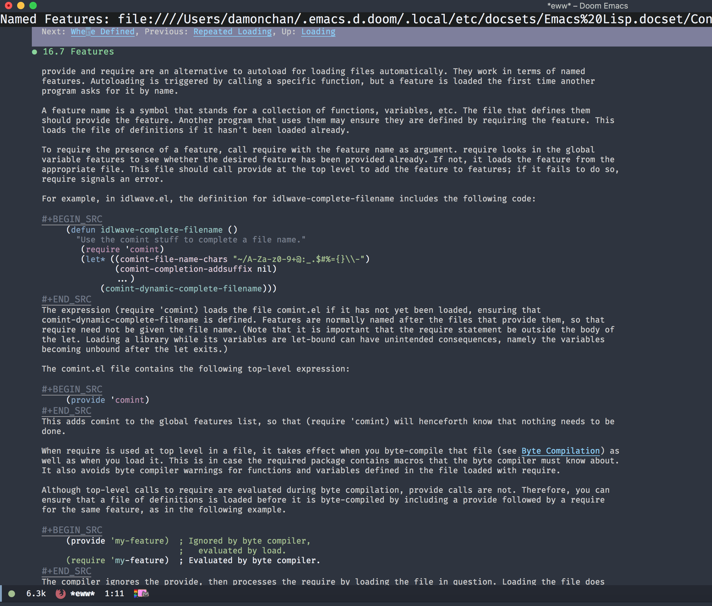
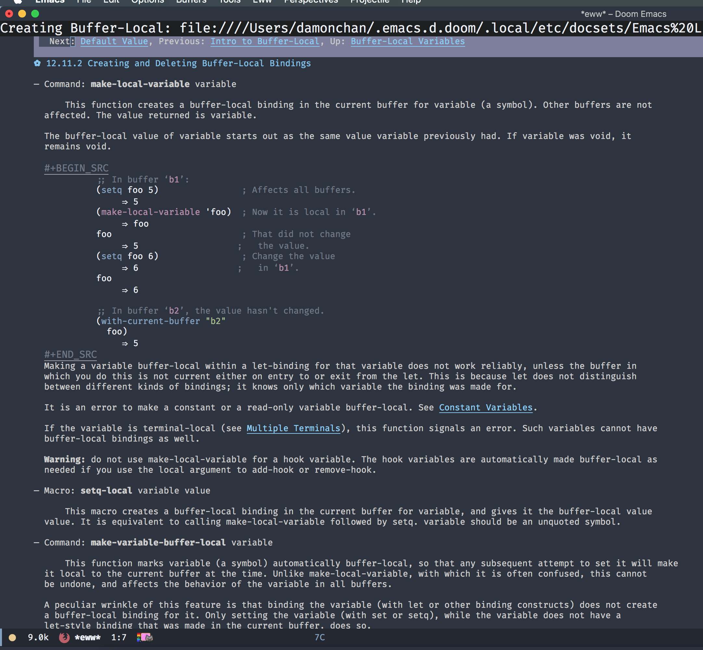
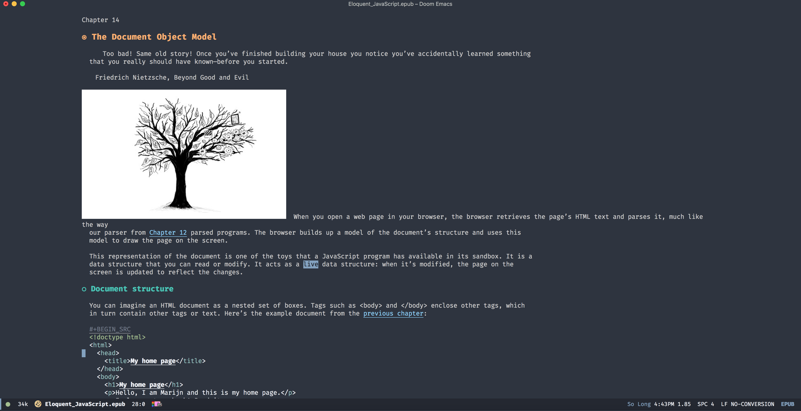
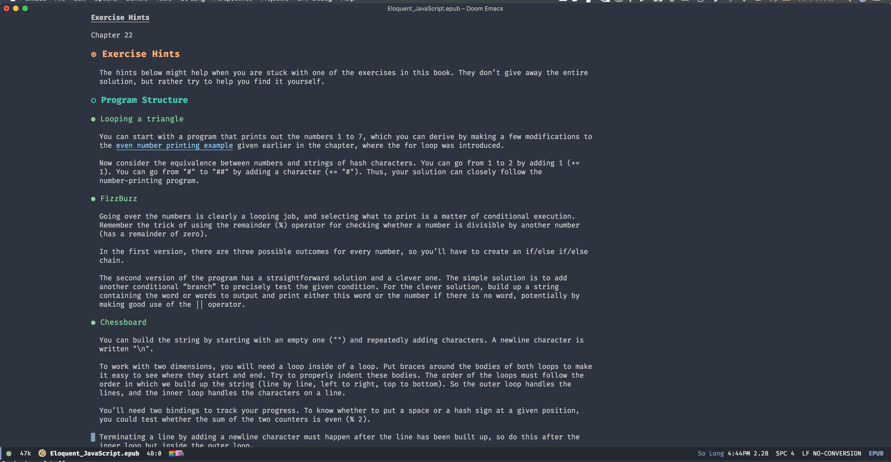

---
author:
- Damon Chan
date: 'April 10, 2020'
since: '{replace with next tagged release version}'
startup: inlineimages nofold
title: SHRFACE
---

Description
===========

It is a shr faces package. Org Like faces for shr, eww, nov.el and more!

-   Org Like Faces
-   Browse the internet with `eww` just like org mode.





-   Read dash docsets with `dash` with the beauty of org faces.





-   Read epub files with `nov.el` with the same reading experience just
    like org mode.





Installation
============

require
-------

Put `shrface.el` to your load-path. The load-path is usually \~/elisp/.
It\'s set in your \~/.emacs like this:

``` {.commonlisp org-language="emacs-lisp"}
(add-to-list 'load-path (expand-file-name "~/elisp"))
(require 'shrface)
```

use-package
-----------

``` {.commonlisp org-language="emacs-lisp"}
(use-package shrface
  :ensure t
  :after shr)
```

Doom Emacs
----------

Add the following line to `package.el`

``` {.commonlisp org-language="emacs-lisp"}
(package! shrface :recipe (:host github :repo "chenyanming/shrface"))
```

Run `./.emacs.d/bin/doom sync`

Prerequisites
=============

This module has no prerequisites.

Configuration
=============

`eww`, `dash-docs`, and other `shr` based packages
--------------------------------------------------

Normally, just require the package, and you can make use of all benefits
brought by the package:

``` {.commonlisp org-language="emacs-lisp"}
(require 'shrface)
```

Enable the `shrface` for `nov.el`
---------------------------------

If you read epub files using `nov.el`, you can add one more line into
your `init.el`

``` {.commonlisp org-language="emacs-lisp"}
(setq nov-shr-rendering-functions shr-external-rendering-functions)
```

Default bullets for headings (h1 to h6)
---------------------------------------

You can configure your farourite bullets for 6 levels of headings.

In case of errors, you have to set at least 6 levels.

If you do not set it, here is the default setting:

``` {.commonlisp org-language="emacs-lisp"}
(setq shrface-bullets-bullet-list '("◉" "○" "●" "✿" "◆" "◉")
```

Supported faces
---------------

Here are the faces supported:

``` {.commonlisp org-language="emacs-lisp"}
(defvar shrface-bullets-bullet-list '("◉" "○" "●" "✿" "◆" "◉")
  "Bullets for headings")

(defvar shrface-href-face 'shrface-href-face
  "Face name to use for href.")

(defface shrface-href-face '((t :inherit org-link))
  "Face used for href"
  :group 'shrface-faces)

(defface shrface-h1-face '((t :inherit org-level-1))
  "Face used for h1 headlines."
  :group 'shrface-faces)

(defface shrface-h2-face '((t :inherit org-level-2))
  "Face used for h2 headlines."
  :group 'shrface-faces)

(defface shrface-h3-face '((t :inherit org-level-3))
  "Face used for h3 headlines."
  :group 'shrface-faces)

(defface shrface-h4-face  '((t :inherit org-level-4))
  "Face used for h4 headlines."
  :group 'shrface-faces)

(defface shrface-h5-face  '((t :inherit org-level-5))
  "Face used for h5 headlines."
  :group 'shrface-faces)

(defface shrface-h6-face '((t :inherit org-level-6))
  "Face used for h6 headlines."
  :group 'shrface-faces)
```

Enable source codes highlight
-----------------------------

You can install
[shr-tag-pre-highlight.el](https://github.com/xuchunyang/shr-tag-pre-highlight.el)
to enable source codes highlight

Add the following codes into your `init.el`:

``` {.commonlisp org-language="emacs-lisp"}
(require 'shr-tag-pre-highlight)
(add-to-list 'shr-external-rendering-functions '(pre . shrface-shr-tag-pre-highlight))
(defun shrface-shr-tag-pre-highlight (pre)
  "Highlighting code in PRE."
  (let* ((shr-folding-mode 'none)
         (shr-current-font 'default)
         (code (with-temp-buffer
                 (shr-generic pre)
                 (setq-local fill-column 120)
                 (indent-rigidly (point-min) (point-max) 2)
                 ;; (fill-region (point-min) (point-max) nil nil nil)
                 (buffer-string)))
         (lang (or (shr-tag-pre-highlight-guess-language-attr pre)
                   (let ((sym (language-detection-string code)))
                     (and sym (symbol-name sym)))))
         (mode (and lang
                    (shr-tag-pre-highlight--get-lang-mode lang))))
    (shr-ensure-newline)
    (insert "  ") ; indentation
    (insert (propertize (concat "#+BEGIN_SRC" lang) 'face 'org-block-begin-line)) ; delete "lang" of this line, if you found the wrong detected langugage is annoying
    (shr-ensure-newline)
    (insert
     (or (and (fboundp mode)
              (with-demoted-errors "Error while fontifying: %S"
                (shr-tag-pre-highlight-fontify code mode)))
         code))
    (shr-ensure-newline)
    (insert "  ") ; indentation
    (insert (propertize "#+END_SRC" 'face 'org-block-end-line ) )
    (shr-ensure-newline)))
```
